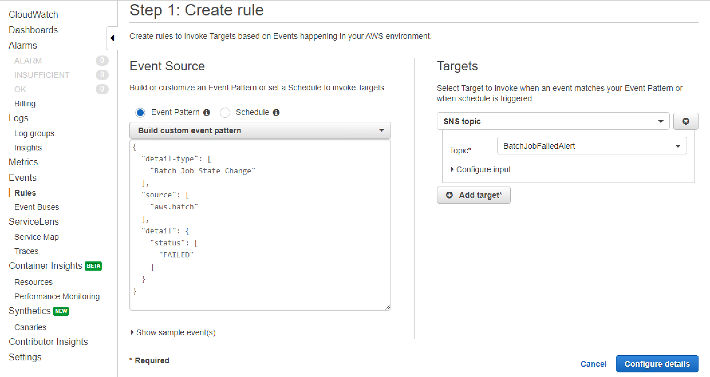
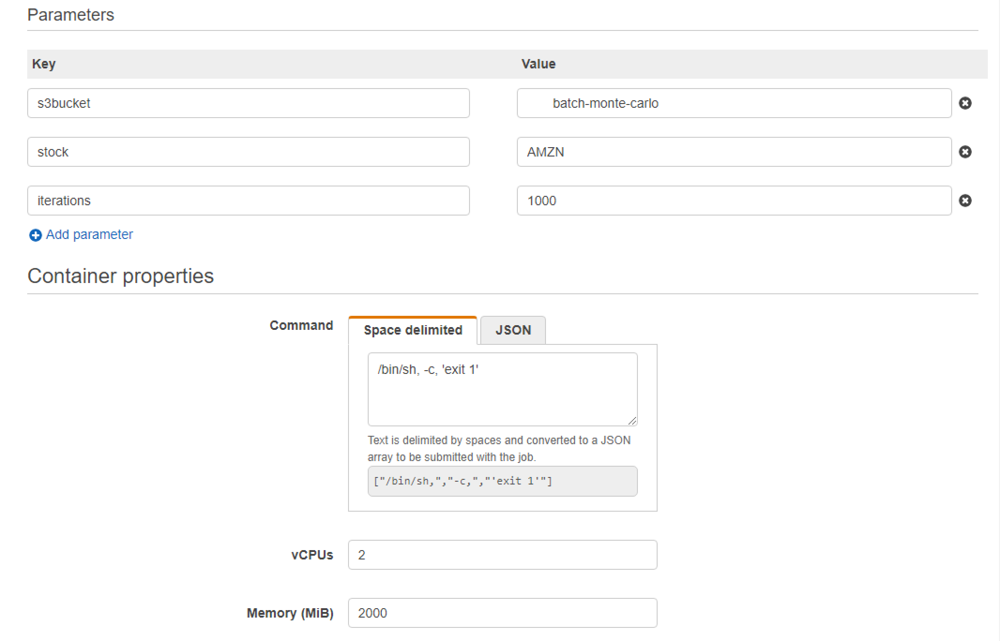

# Module 10: Send a notification when a job execution fails

In this module we will configure a CloudWatch Events rule which will listen to AWS Batch events for when a job enters a `FAILED` status. We will then send an email notification with the failed job details

## 1. Create and subscribe to an Amazon SNS Topic

 We will first configure an Amazon SNS topic to serve as an event target and send a notification email:

1. Open the Amazon SNS console at [https://console\.aws\.amazon\.com/sns/v3/home](https://console.aws.amazon.com/sns/v3/home)

1. Choose **Topics**, **Create new topic**

1. For **Topic name**, enter **BatchJobFailedAlert** and choose **Create topic**

1. Select the topic that you just created. On the **Topic details: BatchJobFailedAlert** screen, choose **Create subscription**

1. For **Protocol**, choose **Email**. For **Endpoint**, enter an email address to which you currently have access and choose **Create subscription**

1.  Check your email account, and wait to receive a subscription confirmation email message. When you receive it, choose **Confirm subscription**

## 2. Register Event Rule

 Next, we will register an event rule that captures AWS Batch failed events:

1. Open the CloudWatch console at [https://console\.aws\.amazon\.com/cloudwatch/](https://console.aws.amazon.com/cloudwatch/)

1. In the navigation pane, choose **Events**, **Create rule**

1. Choose **Show advanced options**, **edit**

1. For **Build a pattern that selects events for processing by your targets**, replace the existing text with the following text:

   ```
   {
     "detail-type": [
       "Batch Job State Change"
     ],
     "source": [
       "aws.batch"
     ],
     "detail": {
       "status": [
         "FAILED"
       ]
     }
   }
   ```

   This code defines a CloudWatch Events rule that matches any event where the job status is `FAILED`

1. For **Targets**, choose **Add target**. For **Target type**, choose **SNS topic**, **BatchJobFailedAlert**

	

1. Choose **Configure details**

1. For **Rule definition**, type a name and description for your rule and then choose **Create rule**

## 3. Test Your Rule

 To test the flow, we will submit a job that exits shortly after it starts with a non-zero exit code:

1. Open the AWS Batch console [https://console\.aws\.amazon\.com/batch/](https://console.aws.amazon.com/batch/)

1. Submit a new AWS Batch job. When creating a job, in the **Container properties** section, for the job's **Command**, override the command to exit the container with an exit code of 1:

   ```
   /bin/sh, -c, 'exit 1'
   ```

	Like so:

	

1. Check your email, within 1-2 minutes you should receive an email for the failed job notification:

	
