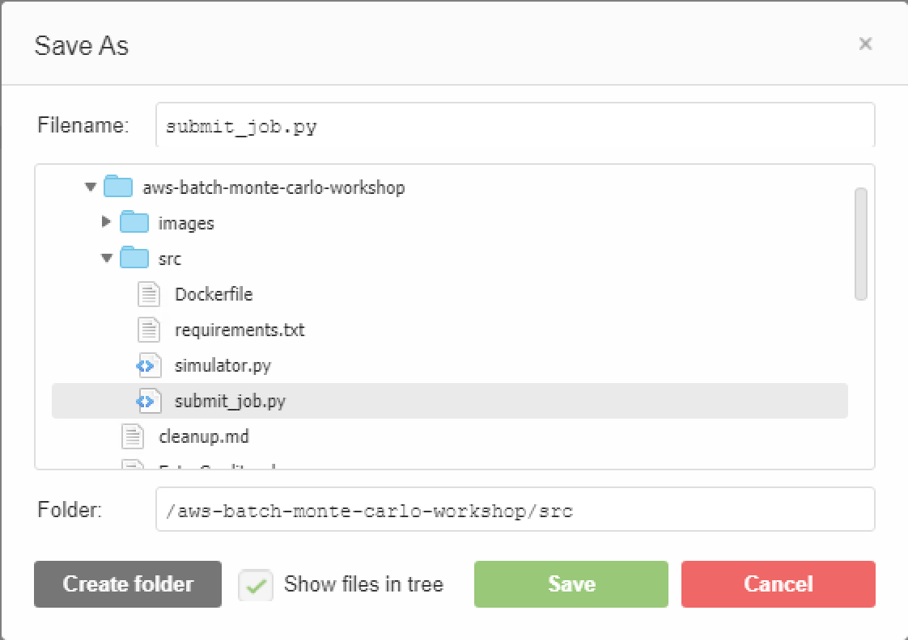
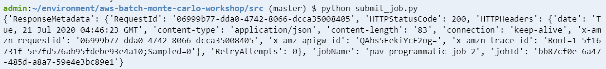
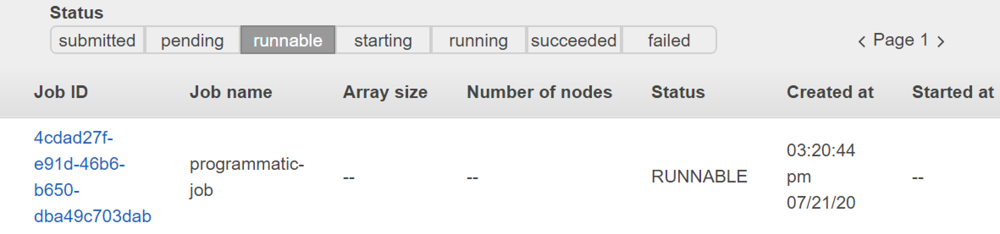

# Module 9: Submit a job programmatically

So far we've been using the AWS Console to submit our jobs, it's time to submit one programmatically.

To submit a job programmatically, we need to create a script which will submit the job via the AWS SDK.

## Instructions

1. Create a file in the Cloud9 IDE by going to **File** --> **New File**

	

1. Paste in below as the content for the submit_job script:

	```
	import boto3

	# Configure the variables for your AWS Batch environment
	job_name = "your job name"
	job_definition_name = "your job definition name"
	job_queue_name = "your job queue name"
	s3_bucket_name = "your s3 bucket name"

	# Submit the job
	batch = boto3.client('batch')
	response = batch.submit_job(
		jobName=job_name,
		jobDefinition=job_definition_name,
		jobQueue=job_queue_name,
		parameters={
			's3bucket': s3_bucket_name,
			'iterations': '1000',
			'stock': 'AMZN'
		},
	)

	# Print the response
	print(response)

	```

	Take a moment to review at how a simple script to submit a job programmatically is written:

	- **import boto3** - Imports the AWS Python SDK

	- **batch = boto3.client('batch')** - Initializes the AWS Batch client

	- **batch.submit_job()** - Submits the job to AWS Batch based on the specified parameters

	- **print(response)** - Finally, it prints the response from AWS Batch


1. Save the file as **submit_job.py** in the `src/` folder

	

1. In the terminal:

	Ensure you are in the `src/` directory:

	```
	cd ~/environment/aws-batch-monte-carlo-workshop/src
	```

	Execute the script via terminal

	```
	python submit_job.py
	```

1. You should see the successful response from AWS Batch

	

1. When you go back to the AWS Batch console you'll be able to see the job up and running

	


## Next step

Move on to [**Module 10: Send a notification when a job is finished running**](./Module10.md)
